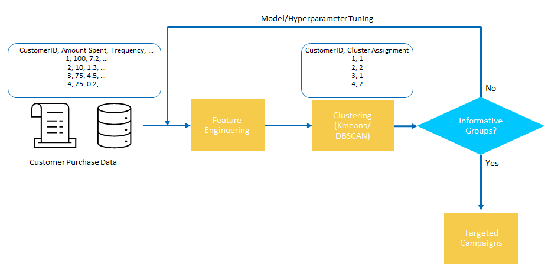
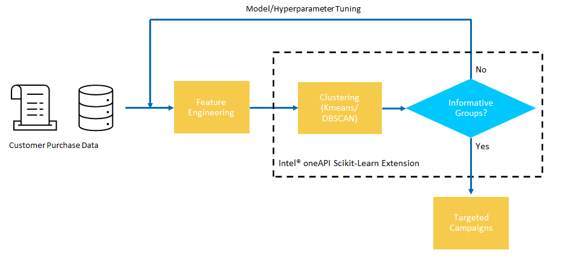
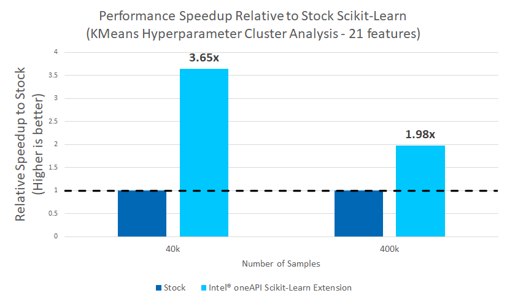
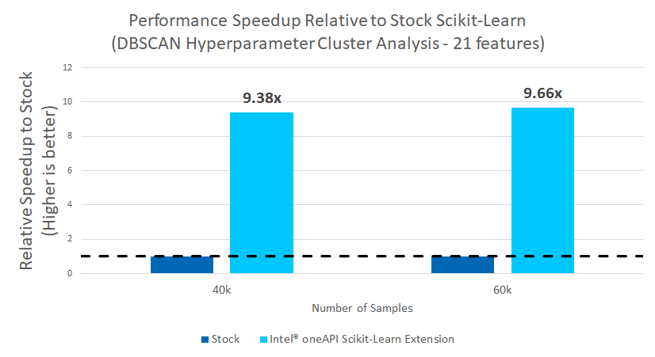

# **Customer Segmentation for Online Retail using Scikit-Learn**

## **Table of Contents**
 - [Purpose](#purpose)
 - [Reference Solution](#reference-solution)
 - [Reference Implementation](#reference-implementation)
 - [Intel® Optimized Implementation](#optimized-e2e-architecture-with-intel%C2%AE-oneapi-components)
 - [Performance Observations](#performance-observations)
 - [Experimental Setup](#experiment-setup)

## Purpose

The growing need for customer analytics in enhancing customer experience and loyalty through predictive analysis as well as personalizing marketing on the past data of the potential customers is driving market growth. Customers expect to be considered as individuals with unique interests, which has shifted the emphasis to personalized brand experiences. This leads to the need to create a unified view of the customer as they connect with a brand and personalize the experience of consumers through networks, locations, and always at the moment.  AI and ML techniques offer a promising opportunity to help analyze and generate an understanding of the different types and patterns of customers within an ecosystem.  

In this reference kit, we demonstrate one way in which ML can aid in building a deeper understanding of a businesses clientele via segmenting customers into clusters, which can be further used to implement personalized and targeted campaigns.

## Reference Solution

The major factors driving the growth of the customer analytics market size include the need to understand customer buying behavior for a more personalized customer experience and the advent of resource-intensive technologies, such as Artificial Intelligence (AI), Machine Learning (ML), and business process automation to streamline marketing operations. Customer analytics will evolve from retrospective analysis to real-time, behavior-driven interaction to achieve a personalized customer experience. Clients using these solutions must re-train their models to deal with ever-increasing and transforming data sets, as well as exploring their current datasets under different lens, if they want their investment to keep producing value.

One of the primary methods for deriving an understanding of customer segments is by analyzing and exploring different AI based clustering algorithms on various feature sets to identify key candidates and customer phenotypes.  

> Customer Dataset => Repeated Cluster Analysis => Targeted Campaigns and Opportunities

The AI opportunity presented here is a system for performing and generating the many cluster solutions for a dataset, which can then be further explored by an analyst to provide insights.

### Key Implementation Details

The reference kit implementation is a reference solution to the described use case that includes:

  1. A reference E2E architecture to arrive at an AI solution with KMeans and DBSCAN from Scikit-learn
  2. An Optimized reference E2E architecture enabled with Intel® Scikit-Learn Extension available as part of Intel® oneAPI AI toolkit optimizations 


## Reference Implementation

### E2E Architecture



### Expected Input-Output

**Input**                                 | **Output** |
| :---: | :---: |
| Customer Features         | Cluster Assignments for each Customer |

**Example Input**                                 | **Example Output** |
| :---: | :---: |
| ***ID***, ***Attribute 1***, ***Attribute 2*** <br> 1, 100, 7.2 <br> 2, 10, 1.3 <br> 3, 75, 4.5 <br> 4, 25, 0.2 |***ID***, ***Cluster Assignment*** <br> 1, 1 <br> 2, 2 <br> 3, 1 <br> 4, 2 |

### Dataset

This reference kits is implemented to demonstrate on an experiment dataset. The dataset used for this demo is a set of 500k transactions covering 4000 customers from a UK multinational online retailer.  The dataset was collected over the span of 1 year and can be found at https://archive-beta.ics.uci.edu/ml/datasets/online+retail.  Instructions for downloading the data for use can be found at the `data/README.md`.

Before clustering analysis, the data is preprocessed to focus on customer purchasing behavior and a feature store of 21 features are generated during this process, including features such as purchase frequency and preference for day of the week.

> **Please see this data set's applicable license for terms and conditions. Intel Corporation does not own the rights to this data set and does not confer any rights to it.**

### Hyperparameter Cluster Analysis

Rather than providing a single clustering solution, in realistic scenarios, an analyst will need to run the same clustering algorithm multiple times on the same dataset, scanning across different hyperparameters to find the most meaningful set of clusters.  To capture this, our reference solution scans across a grid of hyperparameters for the selected algorithm, and generates a clustering solution at each of these points, which is defined as hyperparameter cluster analysis.  At each hyperparameter setting, the clustering solution and the trained model is saved for analysis.  In practice, the results at each hyperparameter setting provides the analyst with many different segmentations of the data that they can take and further analyze.

## Software Requirements

To run this reference kit, first clone this repository, which can be done using

```shell
git clone https://www.github.com/oneapi-src/customer-segmentation
```

We have two options for running our jupyter notebooks, using docker and using anaconda locally. We include instructions for both methods.
<ul>
    <li>
Option 1:

Use Docker, by using docker you just build and run the docker with no additional setup. Instructions for how to use docker can be found [here](docker/README.md)
</li>

<li>Option 2:

Note that this reference kit implementation already provides the necessary scripts to setup the software requirements. To utilize these environment scripts, first install Anaconda/Miniconda by following the instructions at the following link

https://docs.conda.io/projects/conda/en/latest/user-guide/install/index.html
</li>
</ul>

### Reference Solution Setup

The `setupenv.sh` can be used to automate the creation of a conda environment for execution of the algorithms using the statements below.

```shell
./setupenv.sh
1. stock
2. intel
? 1
```
This script utilizes the dependencies found in the `env/stock/stock.yml` file to create an environment as follows:

**YAML file**                                 | **Environment Name** |  **Configuration** |
| :---: | :---: | :---: |
| `env/stock/stock.yml`             | `cust_seg_stock` | Python=3.7.x with stock Sci-kit Learn

For the workload implementation to arrive at first level reference solution we will be using the stock environment


## Optimizing the E2E Reference Solution with Intel® oneAPI

Although AI delivers a solution to address target recommendation, on a production scale implementation with millions or billions of records demands for more compute power without leaving any performance on the table. Under this scenario, a business analyst aims to do a deep exploratory dive into their customer purchase data to find better opportunities.  In order to derive the most insightful and beneficial actions to take, they will need to study and analyze the clusters generated though various feature sets and algorithms, thus requiring frequent re-runs of the algorithms under many different parameter sets. To utilize all the hardware resources efficiently, Software optimizations cannot be ignored.   
 
This reference kit solution extends to demonstrate the advantages of using the Intel® oneAPI AI Analytics Toolkit on the task of building a targeted understanding of customer characteristics from online order data via cluster analysis.  The savings gained from using Intel® technologies can lead an analyst to more efficiently explore and understand customer archetypes, leading to better and more precise targeted solutions.

### Optimized E2E Architecture with Intel® oneAPI Components



### Optimized Software Components

#### ***Intel® oneAPI Extension for SciKit***

Designed for data scientists, Intel® Extension for Scikit-Learn is a seamless way to speed up your Scikit-learn applications for machine learning to solve real-world problems. This extension package dynamically patches Scikit-learn estimators to use Intel® oneAPI Data Analytics Library (oneDAL) as the underlying solver, while achieving the speed up for your machine learning algorithms.

### Optimized Reference Solution Setup

The `setupenv.sh` can be used to automate the creation of an Intel® oneAPI optimized conda environment for execution of the algorithms using the statements below.

```shell
./setupenv.sh
1. stock
2. intel
? 2
```
This script utilizes the dependencies found in the `env/intel/intel.yml` file to create an environment as follows:

**YAML file**                                 | **Environment Name** |  **Configuration** |
| :---: | :---: | :---: |
`env/intel/intel.yml`             | `cust_seg_intel` | Python=3.7.x with Intel® Sci-kit Learn Extension |

## **Jupyter Notebook Demo**
You can directly access the Jupyter notebook shared in this repo [here](GettingStarted.ipynb). \
\
To launch your own instance, activate either one of the `cust_seg_stock` or `cust_seg_intel` environments created in this readme and execute the following command.
```sh
jupyter notebook
```
Open `GettingStarted.ipynb` and follow the instructions there to perform training and inference on both the Stock and Intel optimized solutions.

## Performance Observations

For demonstrational purposes of the scaling of Intel® oneAPI Extension for SciKit, we benchmark a **hyperparameter cluster analysis** under the following data-augmentation transformations:

1. Using 21 features
2. Replicating and jittering the data with noise to have up to 400k rows (depending on algorithm)
   1. KMeans - 40k, 400k samples
   2. DBSCAN - 40k, 60k samples

We summarize the benchmarking results comparing the Intel® technologies vs the stock alternative on the following tasks:

  1. hyperparameter cluster analysis via KMeans with 21 Features
  2. hyperparameter cluster analysis via DBSCAN with 21 Features

where hyperparameter cluster analysis in this case measures the **total time to generate cluster solutions for the given data at each point on the hyperparameter grid for a given algorithm and data size**.  

The hyperparameters for each algorithm include:

### KMeans
**n_clusters**  | **tol** |                             
| :---: | :---: |
2, 3, 4, 5, 10, 15, 20, 25, 30 | 1e-3, 1e-4, 1e-5 |

### DBSCAN
**min_samples**  | **eps** |                              
| :---: | :---: |
10, 50, 100             | 0.3, 0.5, 0.7 |

Noise is added to ensure that no two rows are exactly the same after replication.  DBSCAN testing is limited to 60k samples for because of memory constraints on the machines used for testing.

#### Results Summary

### 1. hyperparameter cluster analysis via KMeans with 21 Features



### 2. hyperparameter cluster analysis via DBSCAN with 21 Features



### Key Take Aways and Conclusion

1. The Intel® Scikit-Learn Extension offers up to a 3.65x performance improvement on hyperparameter cluster analysis workloads using KMeans with 21 features.
2. The Intel® Scikit-Learn Extension up to 9.66x performance improvement on hyperparameter cluster analysis workloads using DBSCAN with 21 features.

The computational savings obtained will allow for faster analysis of different populations and different clustering hyperparameters to grab deeper insights about the target populations.

## Notices & Disclaimers
Performance varies by use, configuration and other factors. Learn more on the [Performance Index site](https://edc.intel.com/content/www/us/en/products/performance/benchmarks/overview/).<br>
Performance results are based on testing as of dates shown in configurations and may not reflect all publicly available updates.  See backup for configuration details.  No product or component can be absolutely secure. <br>
Your costs and results may vary. <br>
Intel technologies may require enabled hardware, software or service activation.<br>
© Intel Corporation.  Intel, the Intel logo, and other Intel marks are trademarks of Intel Corporation or its subsidiaries.  Other names and brands may be claimed as the property of others.  <br>

## Appendix

### Experiment setup
- Testing performed on: October 2022
- Testing performed by: Intel Corporation
- Configuration Details: Azure D4v5 (Intel® Xeon® Platinum 8370C CPU @ 2.80GHz), 1 Socket, 2 Cores per Socket, 2 Threads per Core, Turbo:On, Total Memory: 16 GB, OS: Ubuntu 20.04, Kernel: Linux 5.13.0-1031-azure , Software: intel-aikit-modin=2021.4.1


| **Optimized for**:                | **Description**
| :---                              | :---
| Platform                          | Azure Standard D4v5 : Intel® Xeon Platinum 8370C (Ice Lake) @ 2.80GHz, 4 vCPU, 16GB memory
| OS                                | Ubuntu 20.04
| Hardware                          | CPU
| Software                          | Intel® oneAPI AI Analytics Toolkit v2021.4.1, Scikit-Learn
| What you will learn               | Intel® oneAPI performance advantage over the stock versions

To replicate the full set of experiments detailed in the [Observations](#observations) for each environment, use the 2 bash scripts, `run_exp_intel.sh` and `run_exp_stock.sh`.  Specifically:

1. Download and setup Anaconda/Miniconda from the following link https://docs.conda.io/projects/conda/en/latest/user-guide/install/index.html

2. Clone this repository

    ```bash
    git clone https://www.github.com/oneapi-src/customer-segmentation
    ```

3. Download and prepare the dataset following the instructions [here](data).  
     
    ```bash
    cd data
    wget https://archive.ics.uci.edu/ml/machine-learning-databases/00352/Online%20Retail.xlsx
    xlsx2csv Online\ Retail.xlsx OnlineRetail.csv
    ```

4. Setup the conda environment for stock and intel using the setupenv.sh script

    ```bash
    bash setupenv.sh 
    1
    bash setupenv.sh 
    2
    ```

5. For the stock environment, run the following to run and log results to the logs directory
   
    ```bash
    cd src
    conda activate cust_seg_stock
    bash run_exp_stock.sh
    ```

6. For the intel environment, run the following to run and log results to the logs directory:
  
    ```bash
    cd src
    conda activate cust_seg_intel
    bash run_exp_intel.sh
    ```